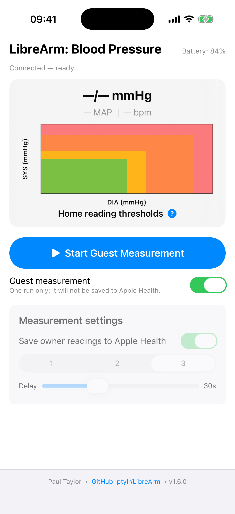
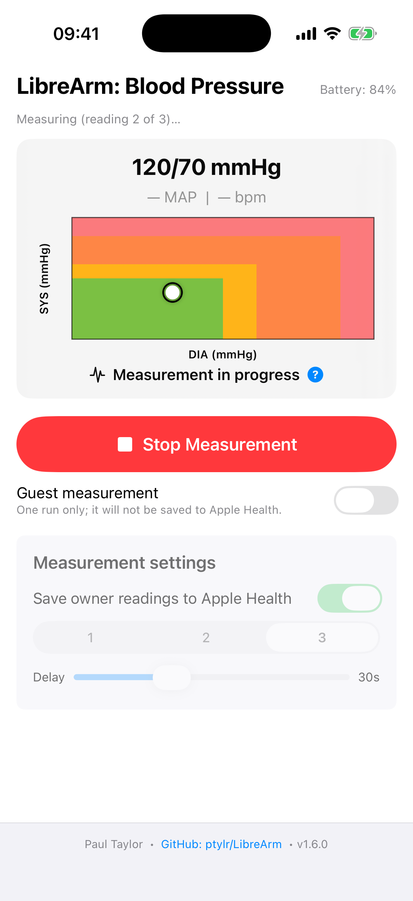
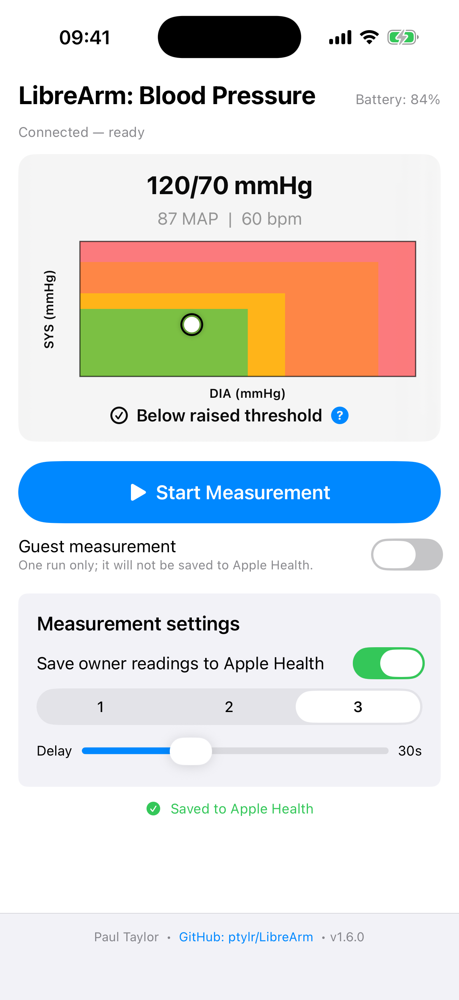
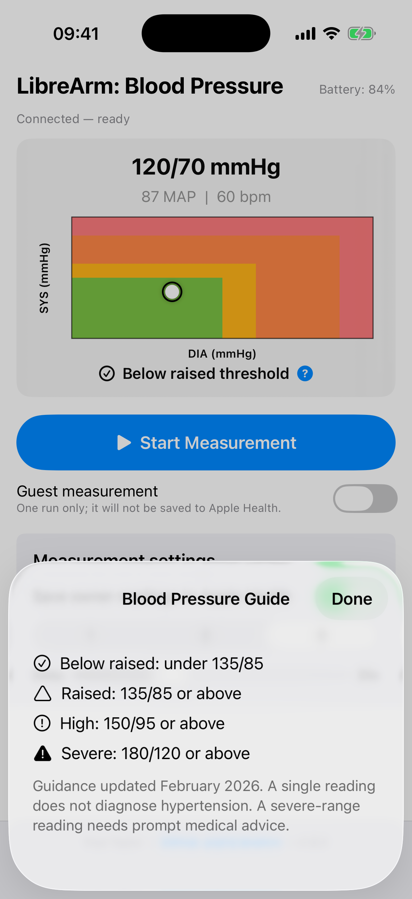

```
        __          .__
_______/  |_ ___.__.|  |_______
\____ \   __<   |  ||  |\_  __ \
|  |_> >  |  \___  ||  |_|  | \/
|   __/|__|  / ____||____/__|
|__|         \/

https://ptylr.com  
https://www.linkedin.com/in/ptylr/
```

# LibreArm

[](https://apps.apple.com/gb/app/librearm/id6752661389)
[](LICENSE)
[](https://github.com/ptylr/LibreArm/releases/latest)

LibreArm is a free, open-source iPhone app that connects directly to a QardioArm blood-pressure monitor over Bluetooth Low Energy and can save completed readings to Apple Health. It requires no Qardio account or cloud service, keeping otherwise functional hardware useful after Qardio ended its backend services and app support.

[Download LibreArm from the Apple App Store](https://apps.apple.com/gb/app/librearm/id6752661389) · [Report a problem or request a feature](https://github.com/ptylr/LibreArm/issues)

🫘 [Buy LibreArm a coffee](https://buy.stripe.com/aFa28tafD9ZydgpeRV9EI00) — LibreArm will always remain free. Voluntary support helps its continued development and does not unlock features or priority.

## Version 1.6.0

Version 1.6.0 is the current development release and includes:

- **One, two or three readings:** choose how many readings LibreArm should take and average, with a configurable 15–60 second interval between multiple readings.
- **Guest measurements:** take a one-off measurement that remains visible in LibreArm but is never saved to the owner's Apple Health data; owner settings are preserved and guest mode switches off after the completed run.
- **Clear Apple Health outcomes:** see when authorisation is being requested and whether a reading was saved, partially saved, skipped or failed, with recovery guidance when access is unavailable.
- **More reliable measurement handling:** notification-confirmed readiness, owned connection and measurement timeouts, safe cancellation, ordered cuff commands and clearer pairing recovery.
- **Standards-aware parsing and validation:** parse Bluetooth Blood Pressure Measurement flags, mmHg and kPa units, optional fields and reserved values while keeping structurally valid high readings visible. Unsupported results are displayed with a caution but are not saved.
- **Device-reported irregular pulse indication:** show the cuff's standard irregular-pulse status when supplied, clearly identified as a device report rather than a diagnosis.
- **Compact, accessible home-reading guide:** keep the graph visible throughout the measurement flow, plot readings against the [NICE NG136](https://www.nice.org.uk/guidance/ng136) home-monitoring thresholds, and tap the centred classification for threshold details with text and symbols as well as colour.
- **Foreground battery status:** show available cuff battery information and warn about low or critical levels without claiming continuous background monitoring.
- **Modern project foundations:** a privacy manifest, shared Xcode scheme and focused automated tests for parsing, averaging, Bluetooth command handling and Apple Health save behaviour.

## Screenshots

<table>
  <tr>
    <th>Ready and configured</th>
    <th>Guest measurement</th>
    <th>Multi-reading measurement</th>
  </tr>
  <tr>
    <td></td>
    <td></td>
    <td></td>
  </tr>
</table>

<table>
  <tr>
    <th>Result and home-reading guide</th>
    <th>Threshold guidance</th>
  </tr>
  <tr>
    <td></td>
    <td></td>
  </tr>
</table>

## Getting started

### App Store

Install [LibreArm from the Apple App Store](https://apps.apple.com/gb/app/librearm/id6752661389), allow Bluetooth access, and grant Apple Health write access if you want owner readings saved.

1. Wake the QardioArm and keep it near the iPhone.
2. Open LibreArm and wait for **Connected — ready**.
3. Choose one, two or three readings and, for multiple readings, the interval between them.
4. Leave **Guest measurement** off to save an owner reading to Apple Health, or enable it for a one-off measurement that must not be saved.
5. Tap **Start Measurement** and follow the cuff's normal fitting and positioning instructions.

### Build from source

Requirements:

- Xcode 16.4 or later
- An iPhone running iOS 18.5 or later
- An Apple ID configured in Xcode
- A QardioArm for Bluetooth measurement testing

```bash
git clone https://github.com/ptylr/LibreArm.git
cd LibreArm
open LibreArm.xcodeproj
```

Select your development team under **Signing & Capabilities**, connect an iPhone, then build and run the `LibreArm` scheme. The iOS Simulator can build the interface and run automated tests, but it cannot reproduce the QardioArm Bluetooth connection or validate Apple Health writes.

## Compatibility

LibreArm is designed for iPhone and the QardioArm blood-pressure monitor. Hardware revisions and pairing histories can behave differently; check the [issue tracker](https://github.com/ptylr/LibreArm/issues) for current compatibility reports or open an issue with the iPhone model, iOS version and observable behaviour. Do not publish personal health readings or device identifiers.

The independent [LibreArm Android port](https://github.com/agreenbhm/LibreArm_Android), maintained by [Drew Green](https://github.com/agreenbhm), is a separate community project. Please direct Android questions and contributions to that repository.

## Privacy and security

LibreArm has no accounts, advertising, analytics, tracking, servers or cloud storage. Cuff communication and measurement processing happen locally on the iPhone. With permission, LibreArm writes completed owner readings to Apple Health; it does not read, sell or share Health data.

See the [privacy policy](PRIVACY.md) and [security policy](SECURITY.md) for details.

## Development

- **Language and interface:** Swift and SwiftUI
- **Device communication:** CoreBluetooth Blood Pressure Service (`0x1810`), Blood Pressure Measurement characteristic (`0x2A35`) and the QardioArm control characteristic
- **Battery:** standard Bluetooth Battery Service (`0x180F`) when exposed by the cuff
- **Health:** HealthKit blood-pressure correlation plus an optional separate heart-rate sample
- **Tests:** XCTest coverage for the pure measurement parser, validation and averaging logic, command acknowledgement ordering, pairing error classification and Apple Health outcomes

Run the automated suite from Xcode using **Product → Test** or:

```bash
xcodebuild -project LibreArm.xcodeproj \
  -scheme LibreArm \
  -destination 'platform=iOS Simulator,name=iPhone 17' \
  test
```

Physical iPhone and QardioArm testing remains required for Bluetooth, pairing, cancellation and Apple Health acceptance.

## Contributing and support

Bug reports, focused enhancements and pull requests are welcome:

- Search or open a [GitHub Issue](https://github.com/ptylr/LibreArm/issues).
- Describe reproducible steps, expected behaviour, actual behaviour, iPhone model and iOS version.
- Do not include personal health readings, Apple Health exports, device identifiers or credentials.
- For code changes, keep the scope focused and explain how the change was tested.

Security support is described in [SECURITY.md](SECURITY.md).

## Release history

The release pages contain the complete notes for previous versions.

| Version | Released | Highlights |
|---|---:|---|
| [1.5.0](https://github.com/ptylr/LibreArm/releases/tag/1.5.0) | 12 January 2026 | Always-visible graph, persistent settings and improved layout |
| [1.4.0](https://github.com/ptylr/LibreArm/releases/tag/1.4.0) | 5 January 2026 | Battery monitoring, critical-battery protection and reading validation |
| [1.3.0](https://github.com/ptylr/LibreArm/releases/tag/1.3.0) | 20 October 2025 | Configurable delay and more reliable multi-reading sessions |
| [1.2.0](https://github.com/ptylr/LibreArm/releases/tag/1.2.0) | 14 October 2025 | Three-reading average mode, countdown and session controls |
| [1.1.1](https://github.com/ptylr/LibreArm/releases/tag/1.1.1) | 28 September 2025 | Completed-reading Health saves and stability fixes |
| [1.1.0](https://github.com/ptylr/LibreArm/releases/tag/1.1.0) | 15 September 2025 | App Store-ready connection, interface and HealthKit flow |
| [1.0.0](https://github.com/ptylr/LibreArm/releases/tag/1.0.0) | 15 September 2025 | Initial release |

See [all releases](https://github.com/ptylr/LibreArm/releases) for downloadable source archives and full notes.

## Licence

LibreArm is available under the [MIT Licence](LICENSE).

## Disclaimer

LibreArm is not a medical device and does not provide a diagnosis or medical advice. Do not use it as a substitute for professional care or delay seeking help because of information shown by the app. Follow the monitor manufacturer's instructions and seek appropriate medical advice if a reading or symptom concerns you.

LibreArm is an independent community project and is not affiliated with or endorsed by Qardio, Inc. QardioArm™ is a trademark of Qardio, Inc.; other third-party names and marks belong to their respective owners.
